# Level Library
Welcome to the level library for [ReverSim](https://github.com/emsec/ReverSim)!

If you don't know the environment yet, here is a brief introduction. The full 
documentation can be found in the [accompanying Github repository](https://github.com/emsec/ReverSim).

ReverSim is an open-source environment for the browser, originally developed at the 
[Max Planck Institute for Security and Privacy (MPI-SP)](https://www.mpi-sp.org/)
to study human aspects in hardware reverse engineering.
The main objective is to reverse engineer a variety of Boolean circuits, each containing around 2 to 20 logic gates: 
Participants need to select the correct input values to achieve a set of predetermined output states by operating switches feeding the circuit.
For a valid solution, all lamp symbols in the circuit must be lit up and all danger signs must be turned off.

Circuits in ReverSim consist of eight basic elements:

| Icon                                                              | Description                                 |
| ---------------------------------------------------------------------- | ------------------------------------------- |
| 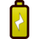         | The battery is used to represent a logical 1. |
|         | Switches are placed after a battery. The participant can open and close them to enter the correct inputs to the circuit. |
|                  | Logic gate with the `AND` function. The output is high if all inputs are high. |
|                    | Logic gate with the `OR` function. The output will be high if at least one input is high. |
|        | Logic gate with the `Inverter` function. The output is low if the single input is high and vice versa. |
|        | One of the two objectives. All lamps have to be ON in order to solve the level. |
|    | One of the two objectives. All danger signs have to be OFF in order to solve the level. |
|  | The `Camouflaged` logic gate performing a function unknown to the participant (see details below). |

The icons for the logic gates are derived from the "distinctive shapes" set defined in [IEEE Std 91/91a-1991](https://en.wikipedia.org/wiki/Logic_gate#Symbols).
Gates are connected with wires to form the circuit. Any junctions are highlighted with a dot.

ReverSim implements two special types of logic gates for research on hardware obfuscation: `Camouflaged`
gates visually obscure their actual gate symbol.
`Covert` gates display a different icon that does
not match their actual logic function, and allow for "dummy inputs" that are visually connected but have no actual effect.
Circuits containing such gates are generally more challenging to reverse engineer. The following table lists the possible
combinations for the `Camouflaged` and `Covert` gates:

|                    | Covert Gate            | Camouflaged Gate          |
| ------------------ | ---------------------- | ------------------------- |
| Icon shown in circuit    | `AND`, `OR`            | `Camouflaged`             |
| Real function (Light blue text in this overview, not visible to the participant)    | `Inverter`, Wire       | `AND`, `OR`               |
| Supports dummy inputs?      | Yes                    | No                        |

Further details about task design and elements are available in the
[level documentation](https://github.com/emsec/ReverSim/blob/main/doc/Level.md#covertgate).

A manual for the tool that was used to generate this level library page is available in the
[screenshot generator documentation](https://github.com/emsec/ReverSim/blob/main/doc/ScreenshotGenerator.md).

## Level Overview
| Name | Switches | Outputs | Gates | AND | OR | NOT | Obfuscated | timeLimit | tags |
| :--- | --- | --- | --- | --- | --- | --- | --- | --- | --- |
| [qualification/alow_00000001](#qualificationalow_00000001) | 3 | 1 | 2 | 2 | 0 | 0 | 0 | 0 |  |
| [qualification/blow_00001000_v2](#qualificationblow_00001000_v2) | 3 | 1 | 3 | 1 | 1 | 1 | 0 | 0 |  |
| [qualification/clow_11111101_random](#qualificationclow_11111101_random) | 3 | 1 | 4 | 0 | 2 | 2 | 0 | 0 | 🎲 |
| [qualification/quali4_random](#qualificationquali4_random) | 3 | 1 | 3 | 1 | 2 | 0 | 0 | 0 | 🎲 |
| [low/Level1_random](#lowlevel1_random) | 3 | 1 | 3 | 1 | 1 | 1 | 0 | 180 | ⏰, 🎲 |
| [low/Level4_random](#lowlevel4_random) | 3 | 1 | 3 | 1 | 1 | 1 | 0 | 180 | ⏰, 🎲 |
| [medium/Level3_random](#mediumlevel3_random) | 3 | 2 | 9 | 3 | 3 | 3 | 0 | 600 | ⏰, 🎲 |
| [medium/Level4_random](#mediumlevel4_random) | 3 | 2 | 9 | 1 | 4 | 4 | 0 | 600 | ⏰, 🎲 |
| [medium/Level5_random](#mediumlevel5_random) | 3 | 2 | 7 | 2 | 3 | 2 | 0 | 600 | ⏰, 🎲 |
| [medium/Level6_random](#mediumlevel6_random) | 3 | 2 | 8 | 3 | 3 | 2 | 0 | 600 | ⏰, 🎲 |
| [high/Level1_random](#highlevel1_random) | 3 | 3 | 12 | 3 | 5 | 4 | 0 | 720 | ⏰, 🎲 |
| [high/Level5_fixed_random](#highlevel5_fixed_random) | 3 | 3 | 12 | 2 | 5 | 5 | 0 | 720 | ⏰, 🎲 |
| [high/r2d7_fixed_improved_random](#highr2d7_fixed_improved_random) | 3 | 3 | 18 | 7 | 3 | 8 | 0 | 720 | ⏰, 🎲 |
| [high/F12_random](#highf12_random) | 3 | 3 | 16 | 7 | 3 | 6 | 0 | 720 | ⏰, 🎲 |
| [camouflaged/Level1_camou_random](#camouflagedlevel1_camou_random) | 3 | 2 | 8 | 2 | 3 | 2 | 1 | 900 | ⏰, 🎲, ❓ |
| [camouflaged/Level7_camou_random](#camouflagedlevel7_camou_random) | 3 | 2 | 8 | 2 | 3 | 2 | 1 | 900 | ⏰, 🎲, ❓ |

**Legend:** 
- ⏰: Has time limit
- 🎲: some switch states are initialized randomly
- ❓: contains camouflage/covert elements

## Screenshots
The following screenshots of the levels will contain some annotations that are not shown in ReverSim:
- The name of the level is displayed in light orange in the top left corner
- The ID of the switches are displayed in light blue, so you can better understand which switch was clicked when looking at the log files
- The switches are in the starting position as defined in the level file. If the initial switch position will be random, a dice icon 🎲 is shown on the switch.
- The actual function of covert/camouflage gates is written in blue letters on top of the visual gate icon

### qualification/alow_00000001
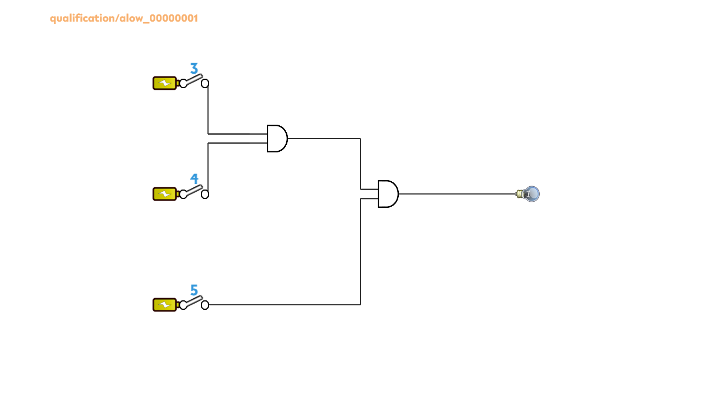

_numSwitches_: 3, _numOutputs_: 1, _numGates_: 2, _numAND_: 2, _numOR_: 0, _numNOT_: 0, _numObfuscated_: 0, _timeLimit_: 0, _numSwitchesRand_: 0

Correct solutions for Switch IDs [3, 4, 5]: `111`

### qualification/blow_00001000_v2
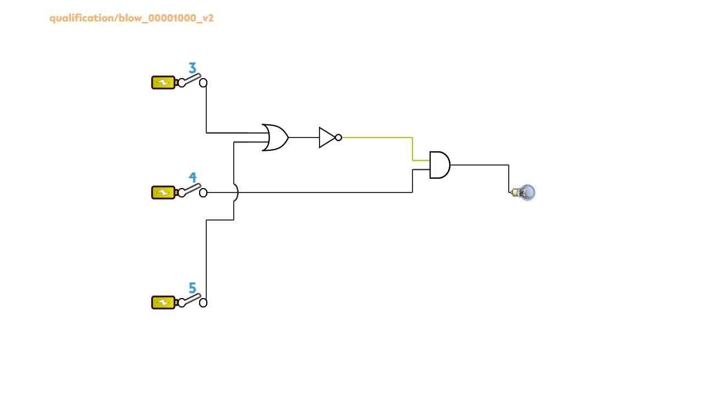

_numSwitches_: 3, _numOutputs_: 1, _numGates_: 3, _numAND_: 1, _numOR_: 1, _numNOT_: 1, _numObfuscated_: 0, _timeLimit_: 0, _numSwitchesRand_: 0

Correct solutions for Switch IDs [3, 4, 5]: `010`

### qualification/clow_11111101_random
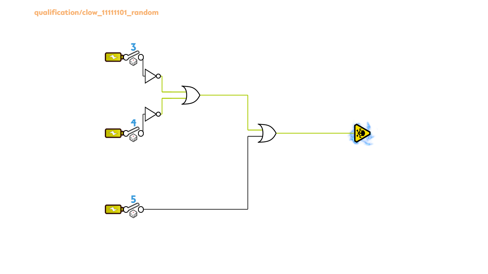

_numSwitches_: 3, _numOutputs_: 1, _numGates_: 4, _numAND_: 0, _numOR_: 2, _numNOT_: 2, _numObfuscated_: 0, _timeLimit_: 0, _numSwitchesRand_: 3, _tags_: 🎲

Correct solutions for Switch IDs [3, 4, 5]: `110`

### qualification/quali4_random
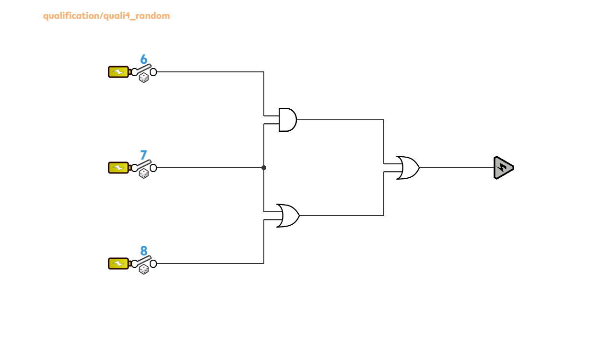

_numSwitches_: 3, _numOutputs_: 1, _numGates_: 3, _numAND_: 1, _numOR_: 2, _numNOT_: 0, _numObfuscated_: 0, _timeLimit_: 0, _numSwitchesRand_: 3, _tags_: 🎲

Correct solutions for Switch IDs [6, 7, 8]: `000`, `100`

### low/Level1_random
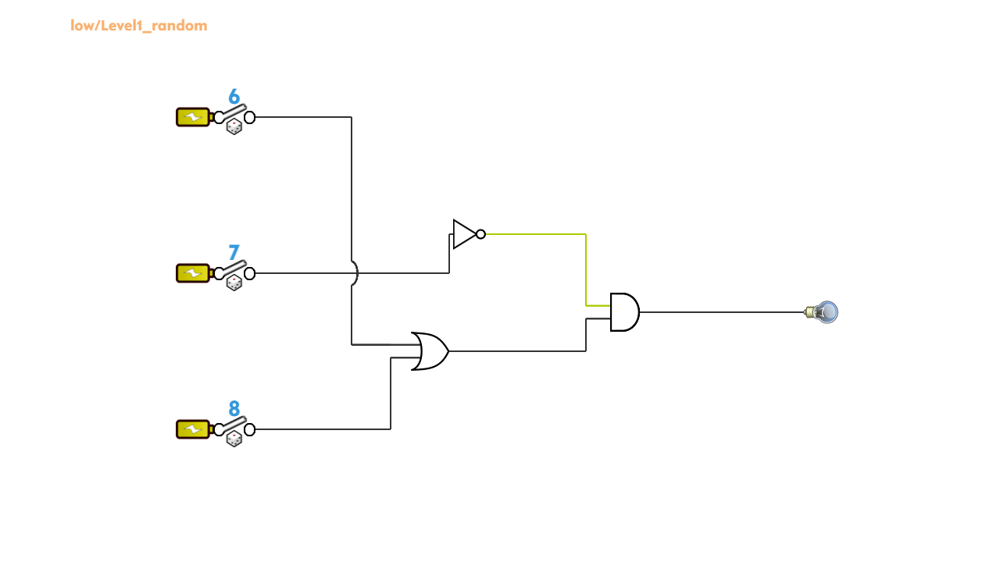

_numSwitches_: 3, _numOutputs_: 1, _numGates_: 3, _numAND_: 1, _numOR_: 1, _numNOT_: 1, _numObfuscated_: 0, _timeLimit_: 180, _numSwitchesRand_: 3, _tags_: ⏰, 🎲

Correct solutions for Switch IDs [6, 7, 8]: `100`, `001`, `101`

### low/Level4_random
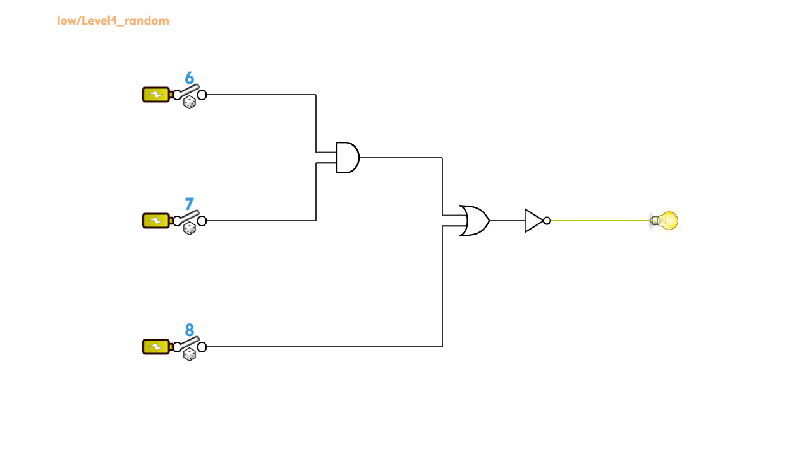

_numSwitches_: 3, _numOutputs_: 1, _numGates_: 3, _numAND_: 1, _numOR_: 1, _numNOT_: 1, _numObfuscated_: 0, _timeLimit_: 180, _numSwitchesRand_: 3, _tags_: ⏰, 🎲

Correct solutions for Switch IDs [6, 7, 8]: `000`, `100`, `010`

### medium/Level3_random
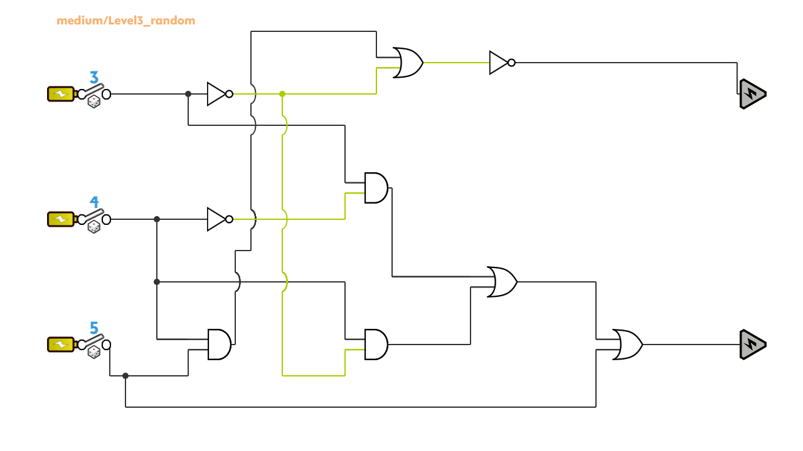

_numSwitches_: 3, _numOutputs_: 2, _numGates_: 9, _numAND_: 3, _numOR_: 3, _numNOT_: 3, _numObfuscated_: 0, _timeLimit_: 600, _numSwitchesRand_: 3, _tags_: ⏰, 🎲

Correct solutions for Switch IDs [3, 4, 5]: `000`

### medium/Level4_random
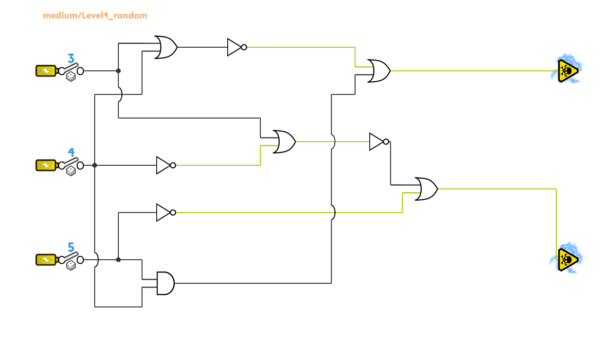

_numSwitches_: 3, _numOutputs_: 2, _numGates_: 9, _numAND_: 1, _numOR_: 4, _numNOT_: 4, _numObfuscated_: 0, _timeLimit_: 600, _numSwitchesRand_: 3, _tags_: ⏰, 🎲

Correct solutions for Switch IDs [3, 4, 5]: `101`

### medium/Level5_random
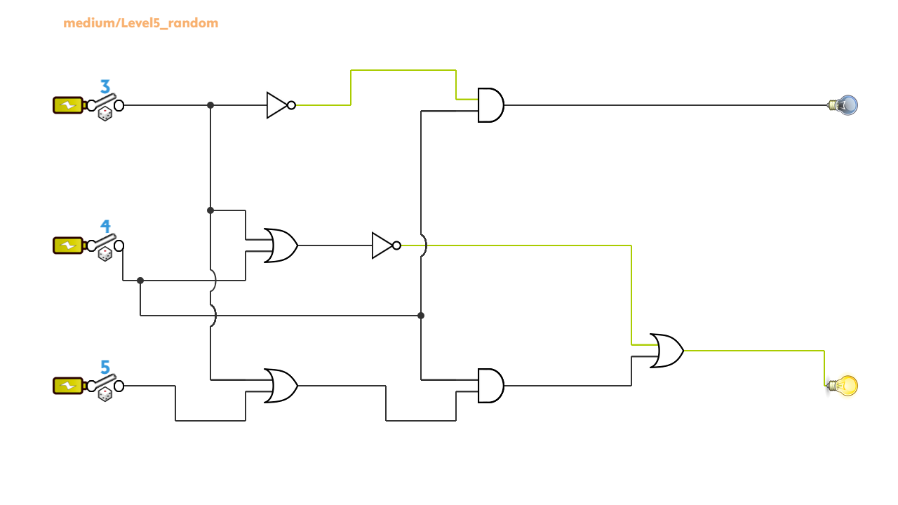

_numSwitches_: 3, _numOutputs_: 2, _numGates_: 7, _numAND_: 2, _numOR_: 3, _numNOT_: 2, _numObfuscated_: 0, _timeLimit_: 600, _numSwitchesRand_: 3, _tags_: ⏰, 🎲

Correct solutions for Switch IDs [3, 4, 5]: `011`

### medium/Level6_random
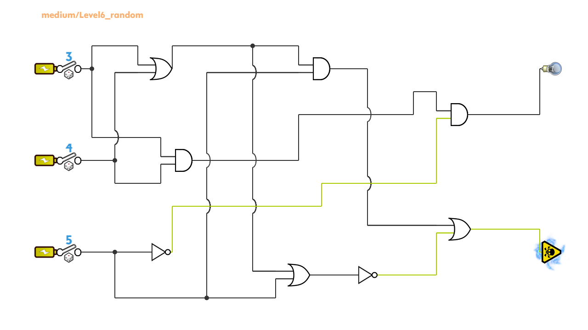

_numSwitches_: 3, _numOutputs_: 2, _numGates_: 8, _numAND_: 3, _numOR_: 3, _numNOT_: 2, _numObfuscated_: 0, _timeLimit_: 600, _numSwitchesRand_: 3, _tags_: ⏰, 🎲

Correct solutions for Switch IDs [3, 4, 5]: `110`

### high/Level1_random
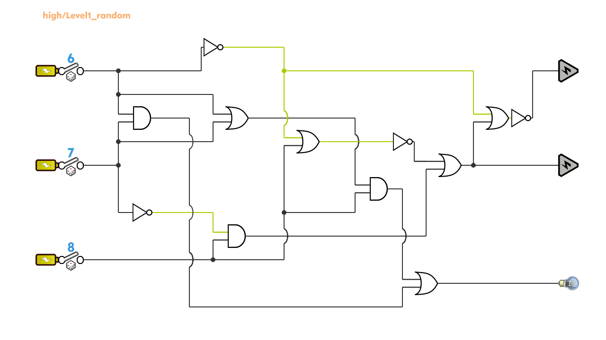

_numSwitches_: 3, _numOutputs_: 3, _numGates_: 12, _numAND_: 3, _numOR_: 5, _numNOT_: 4, _numObfuscated_: 0, _timeLimit_: 720, _numSwitchesRand_: 3, _tags_: ⏰, 🎲

Correct solutions for Switch IDs [6, 7, 8]: `011`

### high/Level5_fixed_random
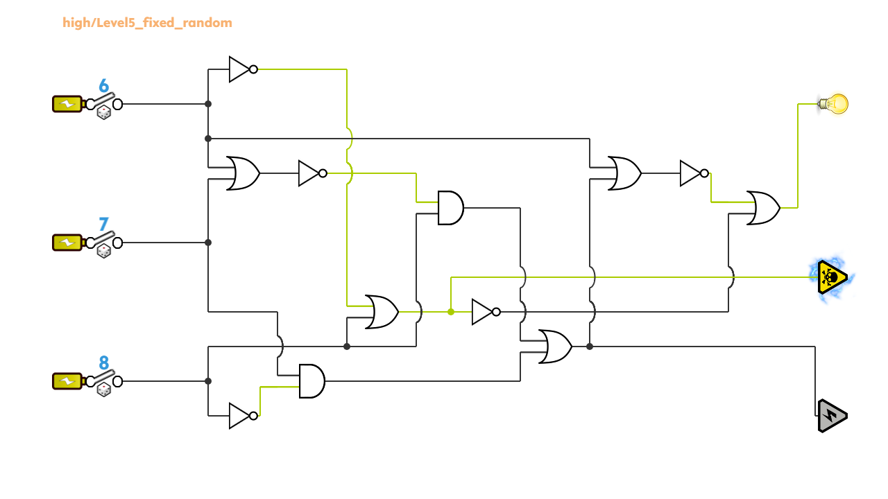

_numSwitches_: 3, _numOutputs_: 3, _numGates_: 12, _numAND_: 2, _numOR_: 5, _numNOT_: 5, _numObfuscated_: 0, _timeLimit_: 720, _numSwitchesRand_: 3, _tags_: ⏰, 🎲

Correct solutions for Switch IDs [6, 7, 8]: `100`

### high/r2d7_fixed_improved_random
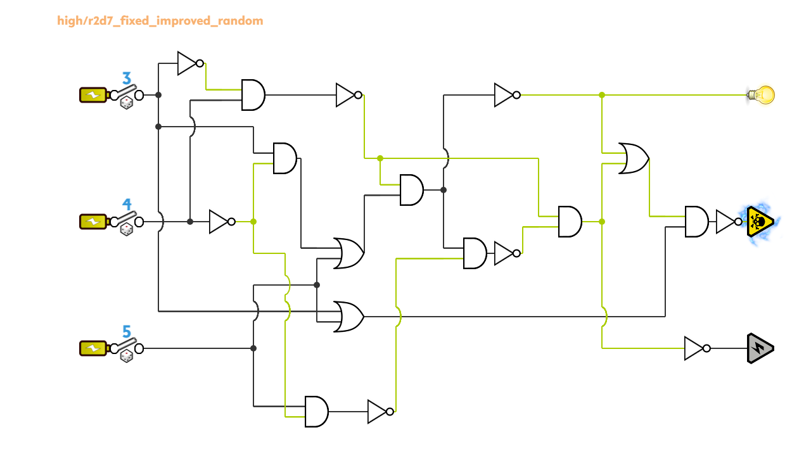

_numSwitches_: 3, _numOutputs_: 3, _numGates_: 18, _numAND_: 7, _numOR_: 3, _numNOT_: 8, _numObfuscated_: 0, _timeLimit_: 720, _numSwitchesRand_: 3, _tags_: ⏰, 🎲

Correct solutions for Switch IDs [3, 4, 5]: `110`

### high/F12_random
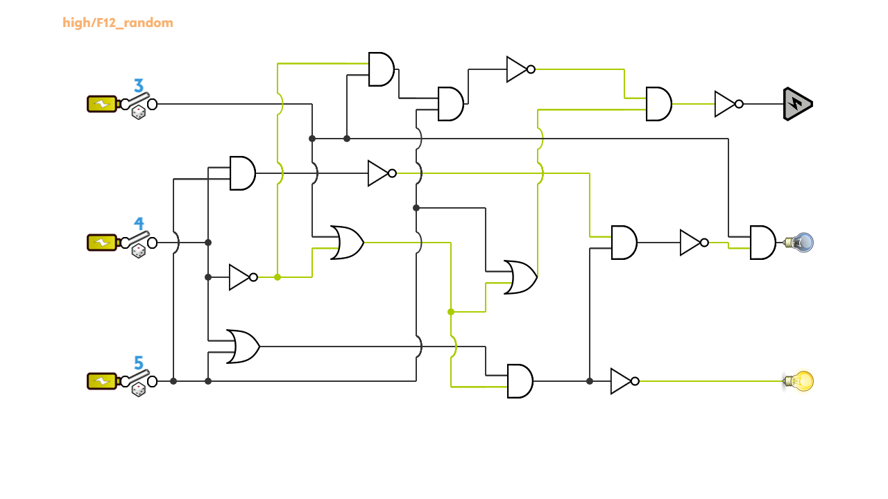

_numSwitches_: 3, _numOutputs_: 3, _numGates_: 16, _numAND_: 7, _numOR_: 3, _numNOT_: 6, _numObfuscated_: 0, _timeLimit_: 720, _numSwitchesRand_: 3, _tags_: ⏰, 🎲

Correct solutions for Switch IDs [3, 4, 5]: `100`

### camouflaged/Level1_camou_random
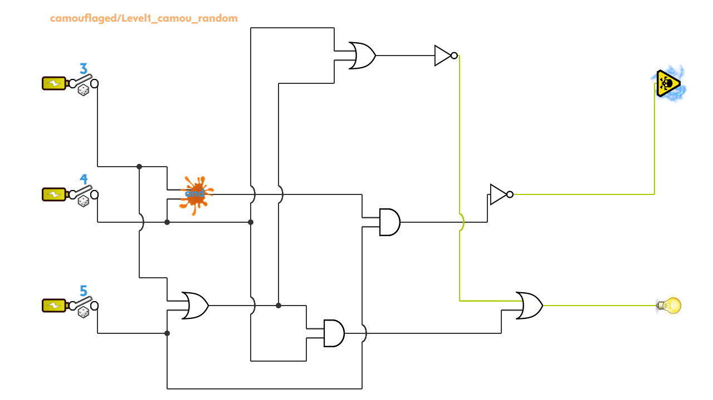

_numSwitches_: 3, _numOutputs_: 2, _numGates_: 8, _numAND_: 2, _numOR_: 3, _numNOT_: 2, _numObfuscated_: 1, _timeLimit_: 900, _numSwitchesRand_: 3, _tags_: ⏰, 🎲, ❓

Correct solutions for Switch IDs [3, 4, 5]: `111`

### camouflaged/Level7_camou_random
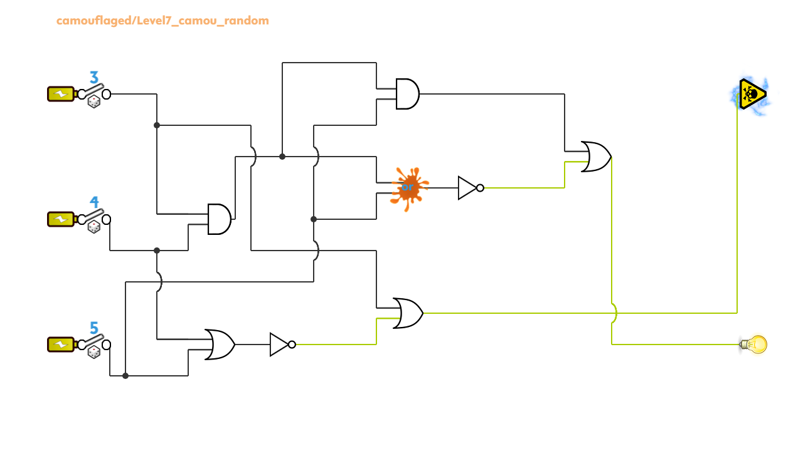

_numSwitches_: 3, _numOutputs_: 2, _numGates_: 8, _numAND_: 2, _numOR_: 3, _numNOT_: 2, _numObfuscated_: 1, _timeLimit_: 900, _numSwitchesRand_: 3, _tags_: ⏰, 🎲, ❓

Correct solutions for Switch IDs [3, 4, 5]: `010`

